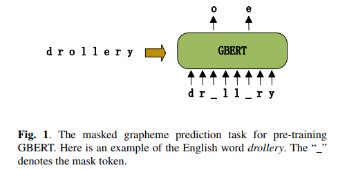
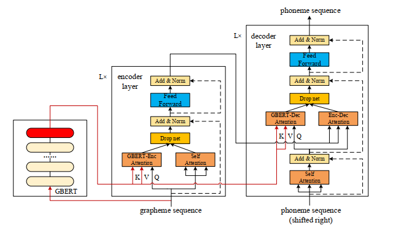
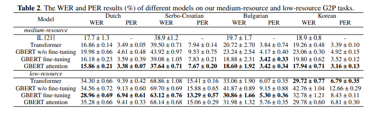
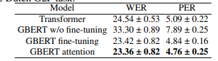

# GraphemeBERT
This is the source code of the paper "Neural Grapheme-to-Phoneme Conversion with Pretrained Grapheme Models".

[Neural Grapheme-to-Phoneme Conversion with Pretrained Grapheme Models](https://arxiv.org/abs/2201.10716) (ICASSP 2022).

_Lu Dong, Zhi-Qiang Guo, Chao-Hong Tan, Ya-Jun Hu, Yuan Jiang and Zhen-Hua Ling_

If you find this repo helpful, please cite the following paper:

````
```bibtex
@inproceedings{dong2021neural,
    title="Neural Grapheme-to-Phoneme Conversion with Pretrained Grapheme Models",
    author={Lu Dong, Zhi-Qiang Guo, Chao-Hong Tan, Ya-Jun Hu, Yuan Jiang and Zhen-Hua Ling},
    year={2022},
    month={May},
    booktitle={2022 IEEE International Conference on Acoustics, Speech, and Signal Processing},
    publisher={IEEE},
    url={https://arxiv.org/abs/2201.10716},
}
```
````

### Some Reference codes
[Transformer](https://github.com/bentrevett/pytorch-seq2seq)

[Beam search](https://github.com/jamesrt95/Multimodal-Multilingual-G2P)

[BERT](https://github.com/codertimo/BERT-pytorch)

[BERT-fused model](https://github.com/bert-nmt/bert-nmt)

### Requirements

- python  3.7
- pytorch 1.7.0
- torchtext 0.5.0 (from pip)
- hangul_jamo 1.0.0 (from pip)
- numpy 
- pandas

## Overview
In this paper, we proposes a pre-trained grapheme model called grapheme BERT (GBERT), which is built by self-supervised training on a large, language-specific word list with only grapheme information. We borrowed the mask machanism of BERT to capture the contextual grapheme information in a word. Furthermore, two approaches are developed to incorporate GBERT into the state-of-the-art Transformer-based G2P model, i.e., fine-tuning GBERT directly or fusing GBERT into the Transformer model by attention. Experimental results on the Dutch, Serbo-Croatian, Bulgarian and Korean datasets of the SIGMORPHON 2021 G2P task confirm the effectiveness of our GBERT-based G2P models under both medium-resource and low-resource data conditions.
1. GBERT

   

   

2. GBERT finetuning
	1. pretrained GBERT encoder + random initialized Transformer decoder
	
3. GBERT attention (This is adopted from [BERT-fused model](https://github.com/bert-nmt/bert-nmt)), which is an application of how to utilize BERT for the generation task (NMT is used in their paper)).

   

   

## File Structure

1. monolingual_GBERT_pretrain
   1. get_wikipron_monolingual_word_data_without_dev_and_test_g2p_word.py  # pretrain GBERT data preprocessing (remove Wikipron words in the dev and test set of the G2P dataset and divided a train and dev word list)
   2. GBERT_pretrain.py  # pre-training a GBERT
2. monolingual_G2P_model
   1. Transformer.py
   2. GBERT_attention.py
   3. GBERT_finetuning.py
3. Data
   1. monolingual_g2p_data  # g2p data
   2. monolingual_g2p_grapheme_bert_input_data  # g2p data for Grapheme BERT input (five column)
   3. monolingual_word_data  # word data(divided train/dev)
   4. monolingual_word_dictionary  # word dictionary(undivided)
4. Model and vocab
   1. pretrain_model_vocab  
   2. torch_models  # pretrain models and downstream G2P models

### Word list

We collected word list from [**WikiPron**](https://github.com/CUNY-CL/wikipron), which is the source G2P database for the [**SIGMORPHON2021 G2P task**](https://github.com/sigmorphon/2021-task1). The raw word lists are in the  `monolingual\_word\_dictionary` , However, we only collected the word list from WikiPron but used no pronunciation information, and we removed the words in the dev and test set of the G2P tasks. To train a monolingual GBERT, we divided the remaining words into training and validation set with the ratio of 9:1。The final divided word lists are in the `monolingual\_word\_data`. 

## Pre-training

The GBERT is a Transformer encoder framework. For all languages, we used a 6-layer Transformer encoder, the training details refers to [BERT](https://github.com/codertimo/BERT-pytorch). Since the pre-trained GBERT is quite small (~4M parameters while BERT has 110M parameters), it will only take ~6h pre-training on a single GTX1080 GPU. So, we did not release our  pre-trained GBERT, you can pre-train a GBERT quickly.

### G2P Datasets
We use the Dutch, Serbo-Croatian, Bulgarian and Korean datasets in the medium-resource subtask of the [**SIGMORPHON2021 G2P task**](https://github.com/sigmorphon/2021-task1) for the experiments.
Since our code is originally build for a multilingual system, our preprocessing code will added a language code for the input words. However, it will be removed in the tokenizer function of the monolingual experiments.


### Train and Evaluate

'''
python x.py >>output.log
'''

The result can be search **_final result_** in the _output.log_. the prediction pronunciation files are not outputed. If you want to get the prediction pronunciation files with word, gold pronunciation and prediction pronunciation, you need to reverse the tokenized index to the  vocab in the evaluate_beam function.

### Implement Details

To reproduce our experimental results for different languages, you may follow our process of tunning hyperparameters for different languages and data condition. The best hypetparameters are chosen by the performance of the corresponding validation set.

1. GBERT
   1. batch size=1024, lr=1e-4, n layers=6, dropout=0.1, gelu (followed by BERT), the experiments of GBERT attention of bul (medium resource) used a GBERT with relu since a GBERT with gelu did not work well.
2. Transformers
   1. batch size(1024/512/256 for medium-resource, 16/8 for low-resource)
   2. lr(1e-3/5e-4)
   3. hid dim(256/128 for medium resource, 128 for low-resource), 
   4. n layers(3 for medium resource, 2 for low-resource),  
   5. dropout(0.1/0.2/0.3) 
   6. relu/gelu
3. GBERT finetuning
   1. The parameters of the transformer decoder follows the paramters of tunned Transformer baseline.
   2. Both the learning rates of the pretrained GBERT encoder and the Transformer decoder are chosen from {1e-3, 5e-4, 3e-4, 1e-4, 1e-5}.
4. GBERT attention
   1. The parameters of the transformer decoder follows the paramters of tunned Transformer baseline.
5. Multilingual experiments
   1. Added a language id for multilingual GBERT
   2. Change the tokenizer manually for multilingual Transformer, which will input a language tag for the input of multilingual Transformer.
6. Our hypermeters (This may be influenced by the random seeds or machines , we ran our model on V100 and Centos 7)
   1. Medium resource
      1. Transformer
         1. dut: batch size 256, lr=1e-3,  hid dim 256, n layers 3, dropout 0.2,  relu
         2. hbs: batch size 256, lr=1e-3,  hid dim 256, n layers 3, dropout 0.2, gelu
         3. bul: batch size 1024, lr=1e-3,  hid dim 256, n layers 3, dropout 0.2,  relu
         4. kor: batch size 256, lr=1e-3,  hid dim 128, n layers=3, dropout 0.2, gelu (the encoder-decoder attention in GBERT finetuning will be (W\_Q 128 ->256, W\_K 256-->256, W\_V 256 --> 256, W\_O 256 --> 128), the encoder-decoder, GBERT-Enc  and GBERT-Dec require something similar)
      2. GBERT finetuning
         1. dut: lr\_encoder=3e-5, lr\_decoder=1e-3
         2. hbs: lr\_encoder=1e-4, lr\_decoder=5e-4
         3. bul: lr_encoder=1e-4, lr_decoder=5e-4
         4. kor: lr_encoder=1e-4, lr_decoder=1e-3
      3. GBERT attention
         1. lr\_second\_train=5e-4 for all experiments.
   2. Low-resource
      1. Transformer
         1. dut:  batch size 8, lr=1e-3, hid dim 128, n layers 2, dropout 0.2, relu
         2. hbs: batch size 16, lr=1e-3, hid dim 128, n layers 2, dropout 0.2, gelu
         3. bul: batch size 16, lr=1e-3, hid dim 128, n layers 2, dropout 0.2, gelu
         4. kor: batch size 8, lr=1e-3, hid dim 128, n layers 2, dropout 0.2, gelu
      2. GBERT finetuning
         1. dut: lr\_encoder=1e-5, lr\_decoder=5e-4
         2. hbs: lr\_encoder=1e-4, lr\_decoder=5e-4
         3. bul: lr_encoder=1e-4, lr_decoder=1e-3
         4. kor: lr_encoder=1e-5, lr_decoder=1e-4
      3. GBERT attention
         1. lr\_second\_train=5e-4 for all experiments.
   3. Low resource Transfer
      1. Transformer
         1. eng + dut: batch size 256, lr=1e-3,  hid dim 256, n layers 3, dropout 0.1,  gelu
      2. GBERT finetuning
         1. eng + dut: lr_encoder=3e-5, lr_decoder=1e-3
      3. GBERT attention
         1. lr\_second\_train=5e-4 for all experiments.

### Results

We report the mean and standard deviation of WER and PER results of five runs the medium-resource and low-resource G2P tasks. 



We also report 




